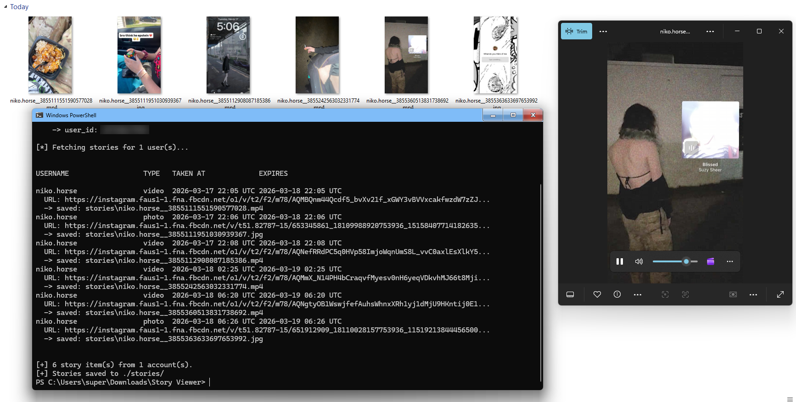

# Instagram Story Thumbnail Extractor

A Python script to fetch Instagram story thumbnails using your auth web session without showing up in the "Who viewed this story" tab
---




## Disclaimer ⚠️🚨💥🤓
### This project is intended for **educational and research purposes only**.

Using this tool may violate Instagram’s Terms of Service

**I AM NOT RESPONSEABLE FOR REPERCUSSIONS TAKEN AGAINST THE USER**

You are responsible for how you use this software.


## Overview

This tool uses Instagram’s web endpoints to retrieve the story preview images for user(s) with an active story.

It works by:

* Authenticating with your session cookies
* Changing usernames into user IDs
* Querying Instagram’s internal GraphQL api endpoint
* Extracting thumbnail image/video URLs

---

## Features

* Fetch story thumbnails for one or multiple users
* Image downloading
* <strong style="font-size: 1.5em;">**LOCAL**</strong> Credential caching (don't need to enter cookies every time)
* Option to export raw JSON output
* CLI interface (no external dependencies ;) )

---

## Installation

```
git clone https://github.com/Nikowoo/Instagram-Story-Viewer
cd instagram-story-viewer

```

No extra packages needed. ;)

---

## Usage

### First Run (Provide Credentials)

```
python3 story.py <username> <sessionid> <csrftoken>
```

The provided credentials will be saved locally for future use.
If you wish to delete the saved credentials you can run with this added argument `--clear-creds`

---

### Subsequent Runs

```
python3 story.py <username>
python3 story.py user1 user2 user3
```

---

### Options

```
# Download thumbnails
python3 story.py <username> --download

# Custom output directory
python3 story.py <username> --download --out-dir <output directory>

# Print raw JSON response
python3 story.py <username> --json

# Clear saved credentials
python3 story.py --clear-creds
```

---

## Credentials Setup

You must extract your Instagram session cookies:

### Steps:

1. Open Instagram in your browser and log in
2. Open Developer Tools (`F12`)
3. Go to the "Network" or "Storage" tab
4. Select: `https://www.instagram.com`
5. Copy the values for: `sessionid` & `csrftoken`

---

## Output

The output prints:

* Username
* Media type (photo/video)
* Timestamp (UTC)
* Expiration time (UTC)
* Thumbnail URL (scrunken down)

---
## How It Works
* Extracts the `user_id` directly from `sessionid`
* Fetches dynamic tokens (`fb_dtsg`, `lsd`) from Instagram homepage
  ```
  /graphql/query
  ```
* Then Parses:
  ```
  image_versions2.candidates
  ```
* Returns thumbnail URLs and metadata

---

## Errors

Common issues:

* **Session expired (HTTP 302)**
:  Re-run with fresh cookies

* **User not found / private**
:  May not return data depending on access

* **Missing tokens**
:  Indicates invalid or expired session

---

## Security Notes

* This code uses your personal Instagram session
* Credentials are stored locally
* Consider using an alt account to avoid being rate limited
